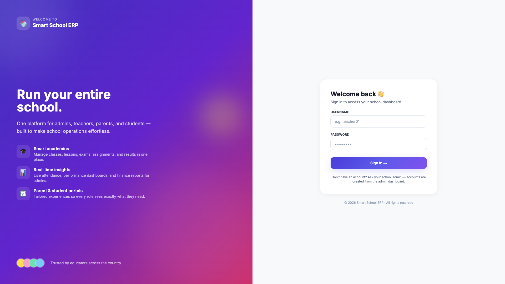
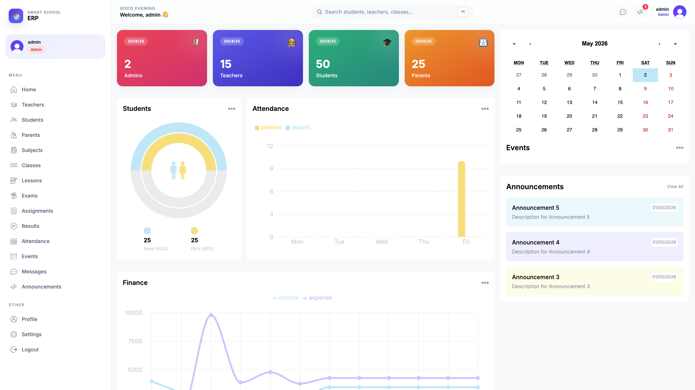
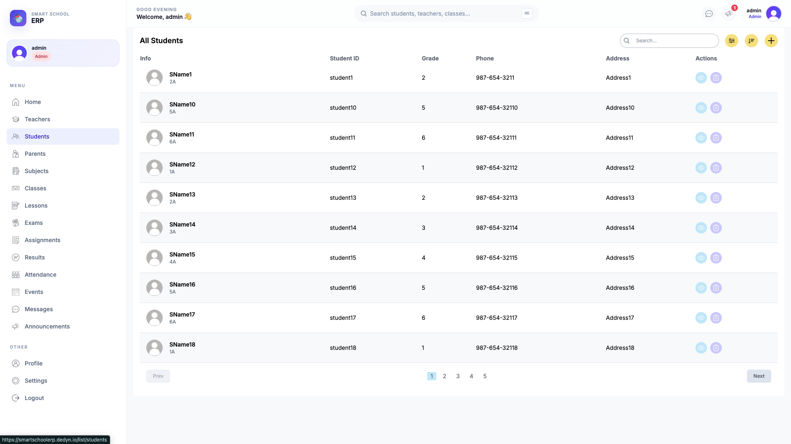
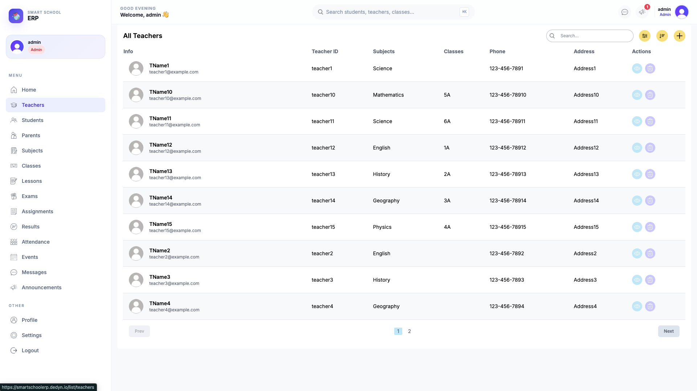
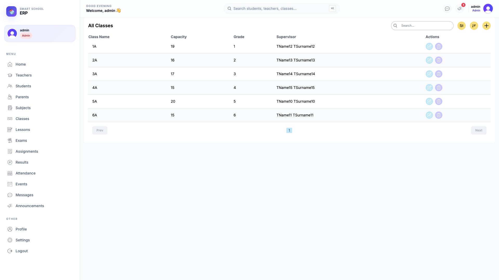
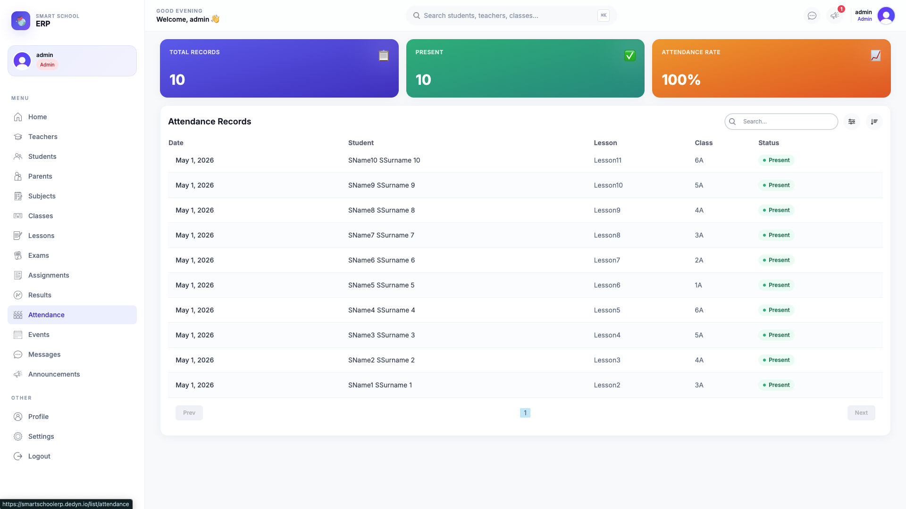
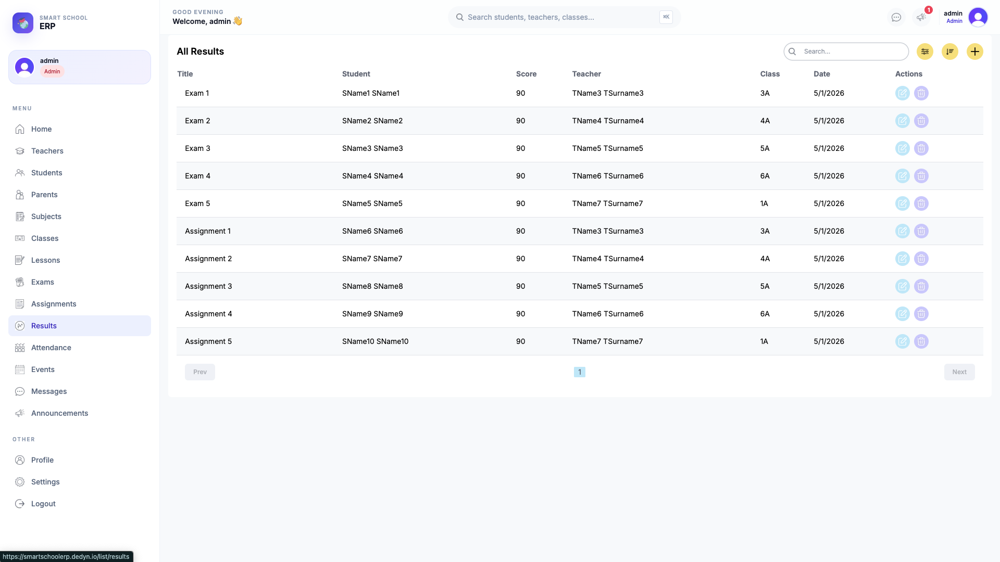

<div align="center">

# 🎓 Smart School ERP

**A production-deployed, role-based school management platform.**

[](https://smartschoolerp.dedyn.io)
[](https://github.com/Jaskirat314276/Winter-Project-24/actions/workflows/deploy.yml)

[](https://nextjs.org/)
[](https://www.typescriptlang.org/)
[](https://www.postgresql.org/)
[](https://www.prisma.io/)
[](https://tailwindcss.com/)
[](https://clerk.com/)
[](https://www.docker.com/)
[](https://aws.amazon.com/ec2/)
[](https://caddyserver.com/)
[](https://github.com/features/actions)

---

🌐 **[Open the live app →](https://smartschoolerp.dedyn.io)** &nbsp;·&nbsp; 📓 **[Engineering changelog →](./CHANGES.md)** &nbsp;·&nbsp; 🚀 **[Deploy runbook →](./DEPLOY.md)**

</div>

---

## 🖼️ At a glance




---

## 💡 Why this project

A real, multi-tenant-ready, role-aware school operations platform with **HTTPS, CI/CD, and zero-downtime deploys** — not a tutorial demo on `localhost:3000`. Designed to demonstrate the full path from feature idea to production:

- **End-to-end ownership** — schema design → server actions → role middleware → Docker image → AWS EC2 → DNS → Let's Encrypt → push-to-deploy
- **Production hardening** — defensive rendering, role-gated mutations, transactional capacity checks with rollback, IP rate limiting, secrets hygiene
- **No managed PaaS** — runs on a single $7/mo EC2 box (Postgres on the same machine, no RDS, no Vercel) yet has the same `git push` → live experience
- **Cost-conscious** — chose deSEC.io (free DNS), Caddy (free TLS), GHCR (free image registry), Cloudinary free tier — total infra cost: **$7/mo**

---

## 🎯 What it does (by role)

|  | Admin | Teacher | Student | Parent |
|---|:---:|:---:|:---:|:---:|
| Aggregate KPIs (counts, attendance, finance) | ✅ | | | |
| Personal class/lesson schedule | | ✅ | ✅ | (per child) ✅ |
| Create / edit / delete users | ✅ | | | |
| Create / edit exams | ✅ | (own lessons only) ✅ | | |
| Browse all students/teachers/parents/classes | ✅ | | | |
| View own children's schedules | | | | ✅ |
| Schoolwide announcements & events | ✅ | ✅ | ✅ | ✅ |

Every role lands on a tailored dashboard. The middleware blocks cross-role access at the route level; server actions block it again at the mutation level (defense in depth).

---

## 📸 Feature gallery

### Admin dashboard — KPIs, gender split, attendance, finance


### List pages with full CRUD (Students)


### Teachers list


### Class management with capacity + supervisor


### Attendance records with daily KPIs


### Results & exam scoring


---

## 🏗️ Architecture

```
                  ┌─ Caddy ───────────────────────┐
   browser ─TLS─► │  smartschoolerp.dedyn.io      │ ──reverse-proxy──► Next.js (App Router)
                  │  (auto Let's Encrypt cert)    │                       │
                  └───────────────────────────────┘                       │
                                                                          ▼
                                          ┌─ Postgres 16 (Docker volume) ◄┘
                                          │  smartschool_default network  │
                                          └────────────────────────────────┘

                       AWS EC2 t3.micro · ap-south-1 · 1 vCPU · 1 GB RAM + 2 GB swap
```

**Push-to-deploy flow:**
```
git push origin main
   ↓
GitHub Actions
   ├─ docker build (multi-stage, ~240 MB final image)
   ├─ docker push ghcr.io/jaskirat314276/winter-project-24:latest
   └─ ssh ec2-user@13.201.26.59 "docker compose pull && docker compose up -d"
   ↓
Live in ~2 min, zero downtime
```

---

## 🛠️ Tech stack

| Layer | Choice | Why |
|---|---|---|
| **Framework** | Next.js 14 (App Router, RSC, Server Actions) | One codebase for routing, rendering, mutations |
| **Language** | TypeScript | End-to-end type safety from schema to UI |
| **DB / ORM** | PostgreSQL 16 + Prisma 5 | Relational integrity, type-safe queries, first-class migrations |
| **Auth** | Clerk (Production env) | Username/password + role via `publicMetadata` |
| **UI** | Tailwind CSS + Recharts + react-big-calendar | Fast iteration, real charts + calendars |
| **Forms** | react-hook-form + Zod | Single source of truth for client + server validation |
| **Image uploads** | Cloudinary (`next-cloudinary`) | CDN-backed photos via unsigned upload preset |
| **Container** | Multi-stage Docker (Alpine, standalone Next, tini) | ~240 MB image, non-root user |
| **Database host** | Docker Compose on same EC2 | Saves ~$12/mo vs RDS for a small school |
| **Reverse proxy** | Caddy 2 | Auto Let's Encrypt + HSTS + zstd/gzip |
| **DNS** | deSEC.io (free) | DNSSEC-capable, modern API |
| **CI/CD** | GitHub Actions → GHCR → SSH | 2-min push-to-deploy, no third-party CD |
| **Compute** | AWS EC2 t3.micro | Free tier 12 mo, then ~$7/mo |

---

## 🔑 Engineering decisions worth highlighting

**1. Defense in depth on authorization.**
Authentication (Clerk) ≠ authorization. Every server action calls a `requireRole(...)` helper before touching the DB. A logged-in student trying to call `deleteTeacher()` directly via DevTools gets `403` from the server, not from the UI. ([`src/lib/auth.ts`](./src/lib/auth.ts), [`src/lib/actions.ts`](./src/lib/actions.ts))

**2. Race-safe class enrollment.**
Two parallel admin actions trying to fill the last seat in a class can no longer over-fill. The capacity check + insert run inside a `prisma.$transaction({ isolationLevel: "Serializable" })`. If Prisma rejects after Clerk created the user, the action **rolls back the Clerk user** so we never leave dangling auth accounts. ([`src/lib/actions.ts`](./src/lib/actions.ts) → `createStudent`)

**3. Defensive rendering + per-segment error boundaries.**
A new student with no class no longer crashes the dashboard with `Cannot read properties of undefined`. Pages render an `EmptyState`, and a route-level [`error.tsx`](./src/app/(dashboard)/error.tsx) catches unforeseen failures so the shell stays alive.

**4. In-memory IP rate limiter on auth routes.**
Anonymous traffic to `/`, `/sign-in*`, `/onboarding` is capped at **30 req/min/IP** with a `Retry-After: 60` header on overflow. Single-process scope (good for one EC2 box; documented swap to Upstash/Redis for multi-replica). ([`src/lib/rateLimit.ts`](./src/lib/rateLimit.ts))

**5. Self-promotion-resistant onboarding.**
`setMyRole` is one-shot — once a user has a role, calling it again is rejected. Only an admin can change roles afterward (via the create-user flow that writes both Clerk + Postgres). Closes a privilege-escalation hole.

**6. Production deploy reality.**
The first three Docker builds failed for **real production reasons**: compose v5 requires buildx ≥ 0.17 (AL2023's bundled Docker doesn't include it); `npx prisma` fetches the latest from npm (currently 7.x, breaking schema syntax change); Next.js standalone mode warns without `sharp`. Each was diagnosed and fixed in [`CHANGES.md §7.5`](./CHANGES.md). The finished image bundles its prisma CLI binary and uses a pinned standalone runtime — boots cold in **84 ms**.

**7. CI/CD without a SaaS deploy provider.**
GitHub Actions builds the image and SSHes into EC2 directly. No Vercel, no Fly, no Render. Three secrets (`EC2_HOST`, `EC2_USER`, `EC2_SSH_KEY`) and a 60-line workflow — that's the whole pipeline. Idempotent: redeploying a no-op commit changes nothing on the box.

---

## 📂 Project structure

```
src/
├── app/
│   ├── (dashboard)/              ← role-gated routes
│   │   ├── admin/                ← admin dashboard + charts
│   │   ├── teacher/              ← teacher schedule + announcements
│   │   ├── student/              ← student schedule (defensive empty state)
│   │   ├── parent/               ← parent view of children
│   │   ├── list/                 ← CRUD list pages (10+ tables)
│   │   ├── error.tsx             ← per-segment error boundary
│   │   └── layout.tsx
│   ├── [[...sign-in]]/           ← Clerk Elements sign-in (catch-all at /)
│   ├── onboarding/               ← landing for users with no role yet
│   ├── global-error.tsx
│   └── layout.tsx
├── components/
│   ├── forms/
│   │   ├── useFormSubmit.ts      ← shared submit + toast + pending-state hook
│   │   └── {Student,Teacher,Class,Subject,Exam}Form.tsx
│   ├── FormModal.tsx             ← lazy-loaded form launcher
│   ├── BigCalendarContainer.tsx
│   ├── {Attendance,Count,Finance}Chart*.tsx
│   └── Announcements / EventCalendar / UserCard
├── lib/
│   ├── actions.ts                ← all Server Actions, role-gated
│   ├── auth.ts                   ← requireRole + AuthorizationError
│   ├── prisma.ts                 ← global PrismaClient singleton
│   ├── rateLimit.ts              ← sliding-window IP throttle
│   ├── formValidationSchemas.ts  ← Zod schemas
│   └── settings.ts               ← route → allowed-roles map
├── middleware.ts                 ← Clerk + role routing + rate limit
└── types/

prisma/
├── schema.prisma                 ← 14 models
├── seed.ts                       ← demo data: 50 students, 15 teachers, 25 parents...
└── migrations/

# Deployment artifacts
Dockerfile                        ← multi-stage, ~240 MB
docker-compose.yml                ← app + postgres + caddy
Caddyfile                         ← auto-TLS + hardening headers
.github/workflows/deploy.yml      ← build → push GHCR → SSH deploy
.env.example                      ← every required env var documented
DEPLOY.md                         ← full EC2 runbook
CHANGES.md                        ← session-by-session engineering log
```

---

## 🚀 Run it locally

```bash
git clone https://github.com/Jaskirat314276/Winter-Project-24.git
cd Winter-Project-24

# 1. Postgres (Homebrew):
brew services start postgresql@15
createdb happydesk && createuser -s happydesk

# 2. Env (Clerk dev keys + Cloudinary cloud name + DATABASE_URL)
cp .env.example .env

# 3. Install + migrate + seed
npm install
npx prisma migrate dev
npx prisma db seed

# 4. Run
npm run dev          # http://localhost:3000
```

To log in: in the Clerk dashboard → **Users** → create a user → set `publicMetadata` to `{"role": "admin"}` → use those credentials.

---

## ☁️ Deploy your own copy

See **[DEPLOY.md](./DEPLOY.md)** for the full step-by-step EC2 + Docker + GitHub Actions runbook. ~30 minutes the first time, `git push` thereafter.

---

## 📓 What changed and why

The complete engineering log is in **[CHANGES.md](./CHANGES.md)** — every fix, every iteration, organized by theme (security, UX, deployment infra, the actual production deploy story, etc.).

---

## 📊 Stats

- **41 files changed** in the production-hardening pass: +1,953 / −709 lines
- **15 server actions** role-gated
- **5 forms** consolidated under one `useFormSubmit` hook
- **2 new error boundaries** + 5 new defensive empty states
- **240 MB** final Docker image
- **~2 min** average deploy time (push to live)

---

<div align="center">

**Built by [Jaskirat Singh](https://github.com/Jaskirat314276)** · April–May 2026

[](https://github.com/Jaskirat314276)

</div>
